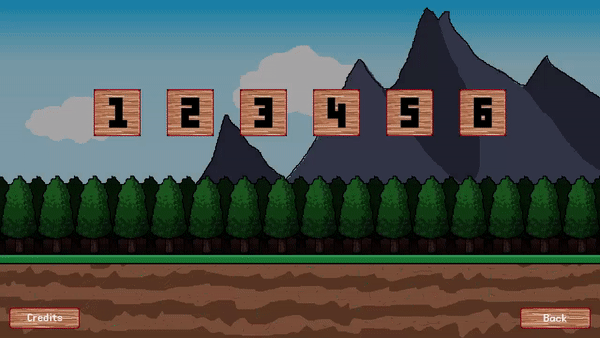

# Chicken Going Rampant
A game made in under 10 days for Gaijin Jam #2.

## Technologies
The game is written in [daScript](https://dascript.org/), a high performance scripting language and run on [dasbox](https://github.com/imp5imp5/dasbox). Both are technologies from Gaijin Entertainment.

## Pentwin framework
A simple mini game framework written in daScript to speed up developing. Found at /gamelib/pentwin.

## Run the game
Run the command:
```
dasbox.exe main.das
```
Targeted platforms: Windows

## Some screenshots
<p align="center">
<br>
<br>

</p>

## Credits
[daScript](https://dascript.org/)/[dasbox](https://github.com/imp5imp5/dasbox) by Gaijin Entertainment

[FreePixel font](https://www.dafont.com/free-pixel.font) by levelb

Sound effects at [mixkit.co](https://mixkit.co/)

Background music ([shimmer](http://dig.ccmixter.org/files/airtone/64622), [reNovation](http://dig.ccmixter.org/files/airtone/60674), [spacedust](http://dig.ccmixter.org/files/airtone/64741), [disOrder](http://dig.ccmixter.org/files/airtone/33608)) by airtone